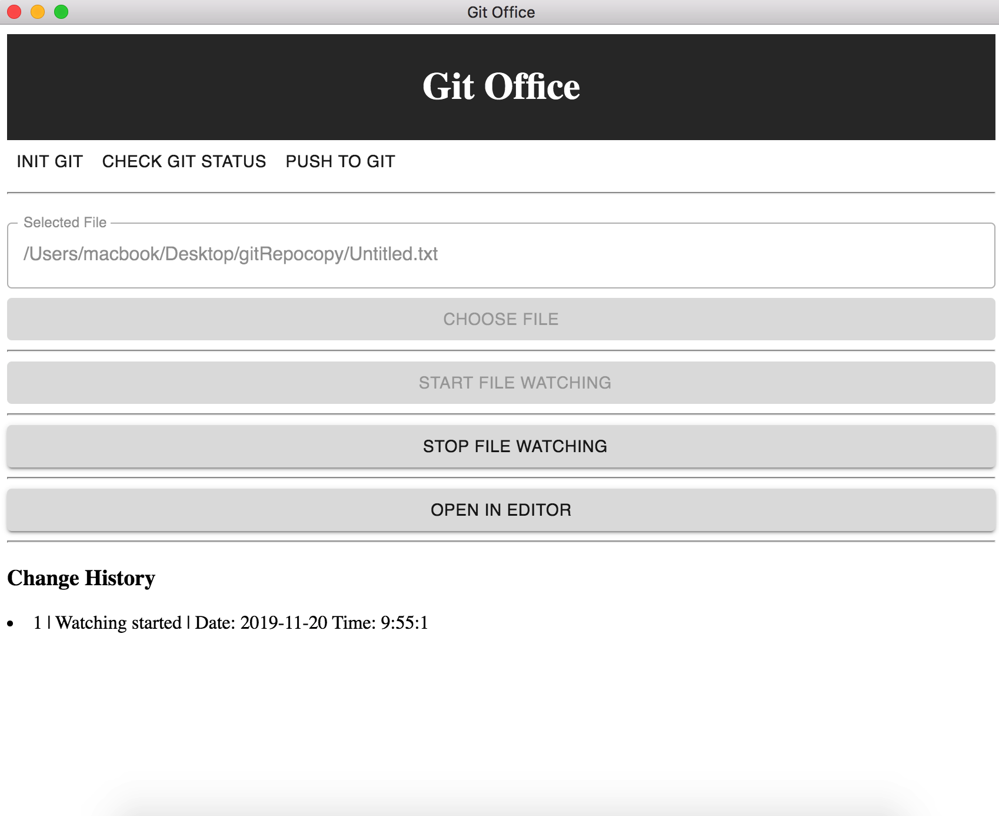
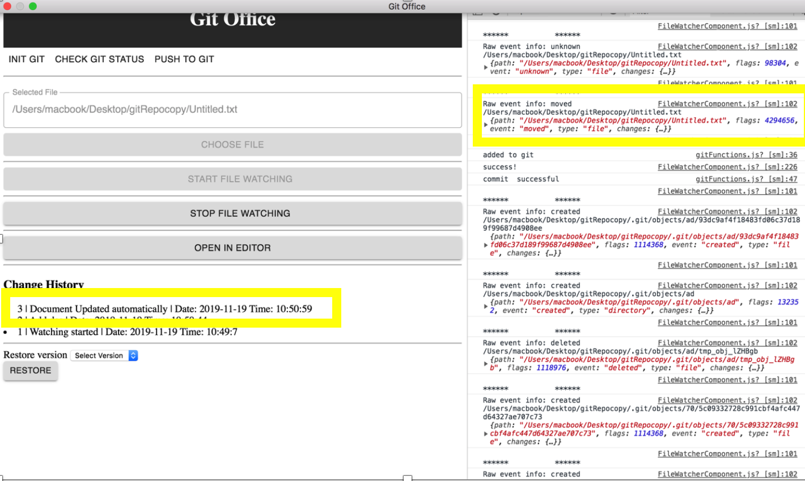
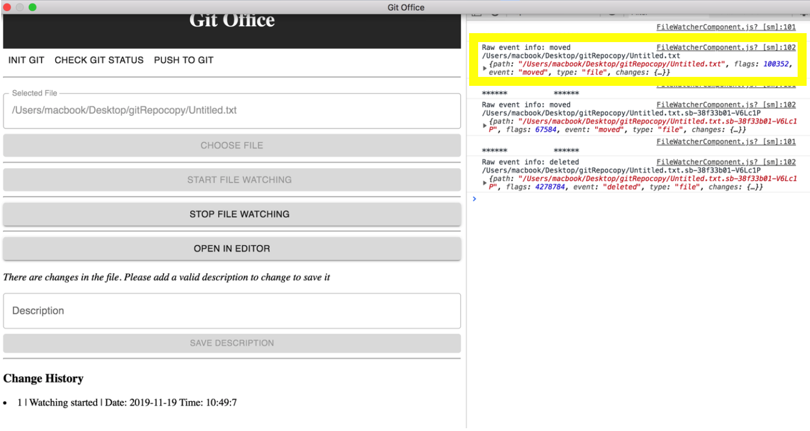

Git Office
==========
Git office is build with [React] and [Electron]. It uses [Babel] with the [babel-preset-airbnb] to
automatically transpile ES6 and JSX code.

Installation:
```bash
npm install
```

Start App:
```bash
npm start
```

## How?
Babel is used with [@babel/register], which provides a require hook for integrating babel. The hook
binds itself to node's `require` and automatically compile files on the fly.

We use the require hook in the [`index.html`](index.html), where also the
[`src/index.jsx`](src/index.tsx) is loaded. The [`src/index.jsx`](src/index.tsx) renders the
`App.jsx` component into the `body`.

[React]: https://facebook.github.io/react/
[Electron]: http://electron.atom.io/
[Babel]: http://babeljs.io
[babel-preset-airbnb]: https://github.com/airbnb/babel-preset-airbnb
[@babel/register]: https://babeljs.io/docs/en/babel-register

## Using the application

Once the button to choose file is clicked, the dialogue box for selecting the desired file will pop 
up.Any file which is in a local git repository can be chosen for watching. Once a file is chosen, it
is possible to start watching by clicking the START FILE WATCHING button. This action adds a new entry 
(Watching started) in the history (and performs **add** and **commit** if the file has any 
modifications ).



User can open the chosen file in its default editor. While the file is being watched by git-office, 
any save action performed by the user in the editor will add a new entry in history with a default 
description.



While the file is being watched by git-office, and if the user opens the file in the editor and make
some changes is file content, git-office asks the user to add a description to the changes as there
are  changes in the file content. Once the user adds a valid description ( 'Add something', 'Remove 
last para', 'Fix some issues' etc), user can save the description and save it.



For every entry in the history log, it performs git add and git commit commands.

User can also perform a push operation to git by clicking the PUSH TO GIT button. INIT GIT  button 
is for initializing a local git repository(/Users/macbook/Desktop/gitRepocopy) by cloning from 
https://github.com/siniann/test.git. (This is just for making manual testing easier.The local and 
remote git repository details can be updated in the ./src/helper/gitFunctions.ts file)

Git-office uses chokidar library for file monitoring, fs-extra for file operations and simple-git for
git operations. 
